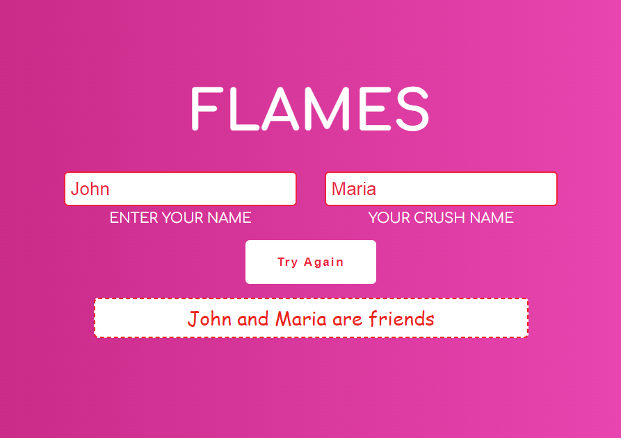

# FLAMES Game

A fun and interactive **FLAMES Game** built using JavaScript. The FLAMES game is a popular childhood game that predicts the relationship between two people based on their names. FLAMES stands for **Friends**, **Lovers**, **Affection**, **Marriage**, **Enemy**, and **Siblings**.

## Features
- **Interactive UI**: Easy-to-use interface for entering names and generating results.
- **Instant Result**: Get the FLAMES result with just a click.
- **Responsive Design**: Works well on both desktop and mobile devices.
- **Pure JavaScript**: No dependencies required.

## Getting Started

### Prerequisites
To play the FLAMES game, you only need a web browser.

### Preview Image


### Installation
1. Clone this repository:
   ```bash
   git clone https://github.com/RoopsBhasima7/flames-game.git
